# Survey Results: Food, Animals, and Commons
Will Jones  
March 26, 2015  


Over a couple weeks, the Quest and Greenboard have been collecting response for
a survey, asking students questions about their beliefs and choices about animals and food,
and whether and in what ways they believe Commons respects those beliefs and choices.

We have recieved 119 responses to our survey.

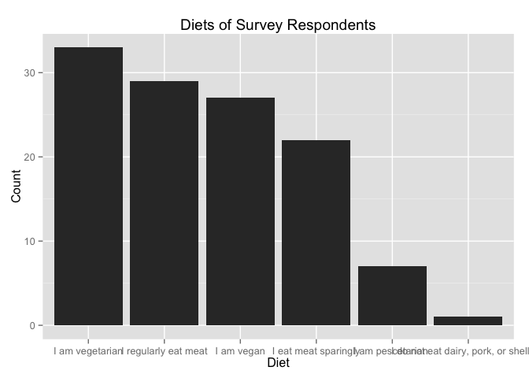 

```
## stat_bin: binwidth defaulted to range/30. Use 'binwidth = x' to adjust this.
```

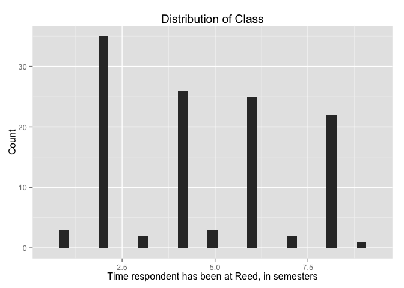 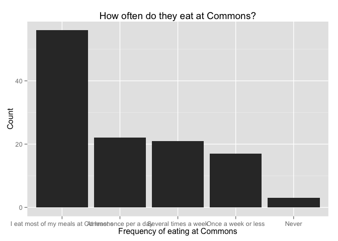 

We have a decent number of people responding saying they are vegetarian, vegan, and regular
meat eaters. Those that eat meat sparingly are a little more sparse in our respondents, but
we definetly can't draw any meaningful conclusions about pescetarians or other diets given
their representation here.

We did seem to get a good distribution across different graduating years of Reedies.


## Attitudes and Beliefs About Animals and Food
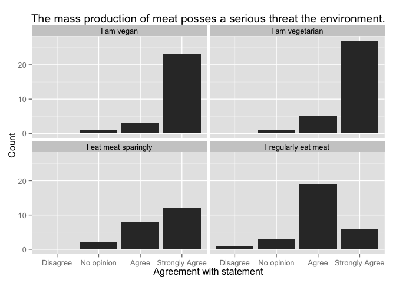 

```
## Strongly disagree          Disagree        No opinion             Agree 
##                 0                 1                 8                36 
##    Strongly Agree 
##                74
```

The majority of respondents, 108 or 92%, either agree or strongly agree that the 
mass production of meat posses a serious threat to the environment. Those that eat
meat regularly are less likely to strongly agree with this statement, as compared
with other diets, however.

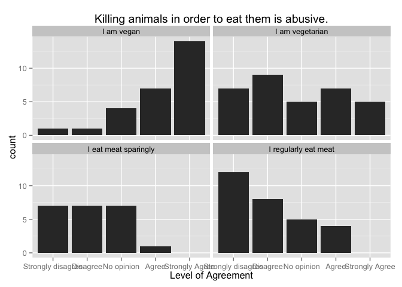 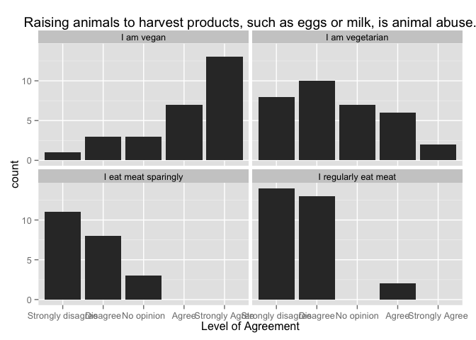 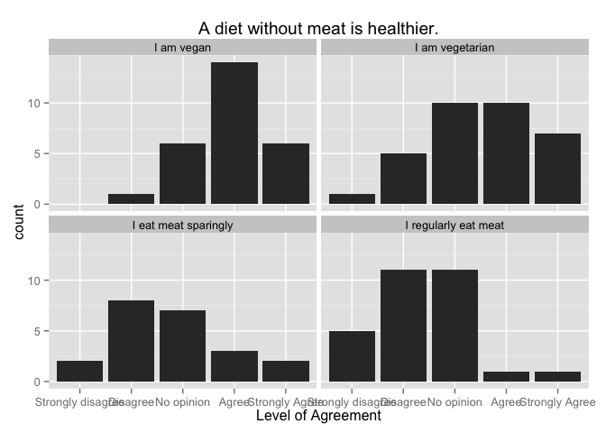 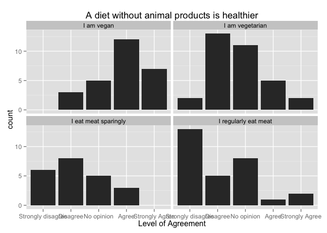 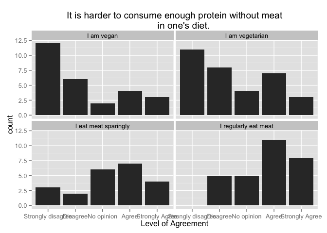 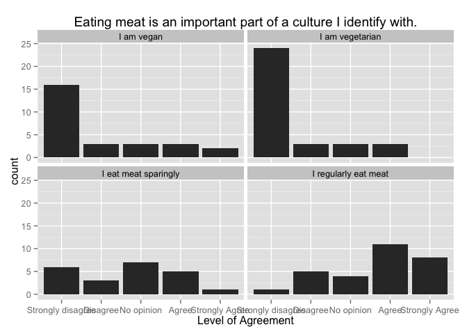 


## On Commons


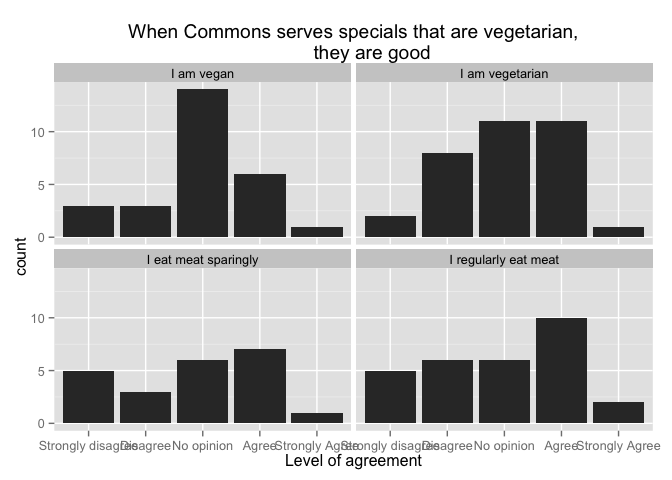 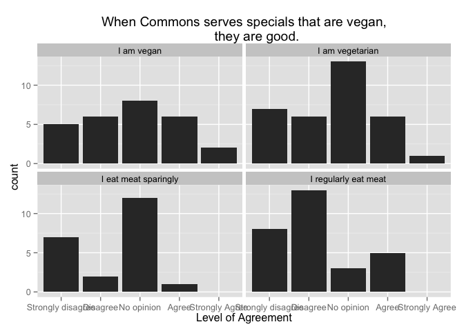 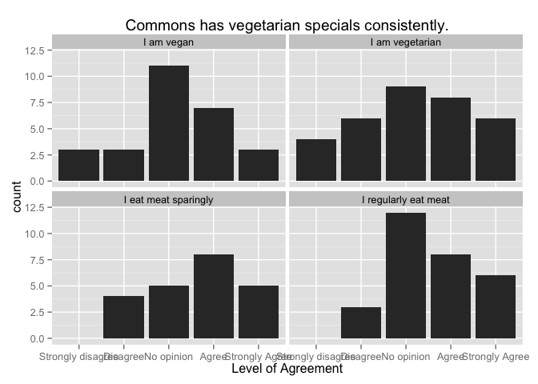 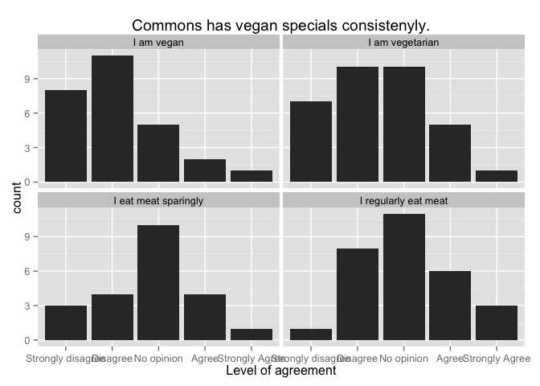 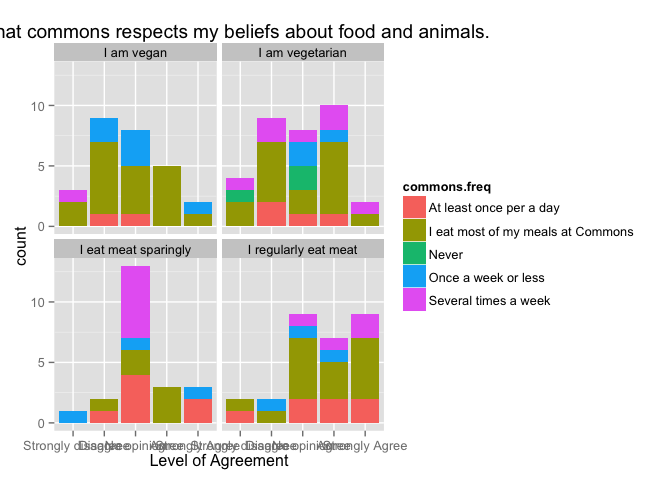 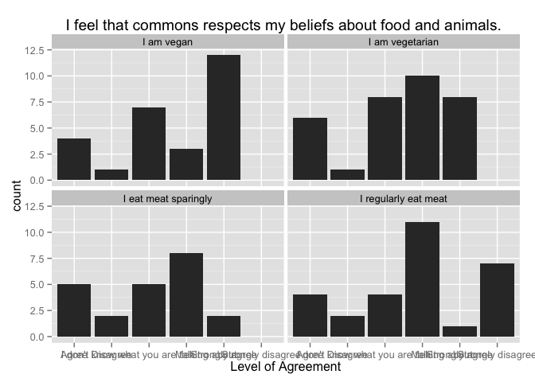 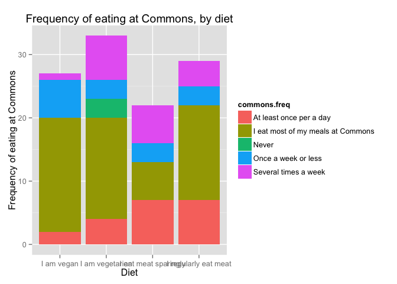 


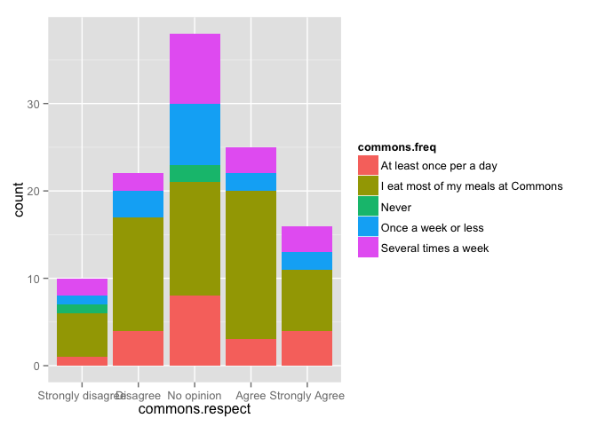 

```
## Strongly disagree          Disagree        No opinion             Agree 
##                 2                 2                 9                 7 
##    Strongly Agree 
##                 9
```

